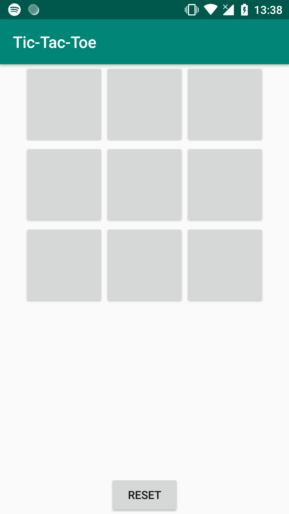
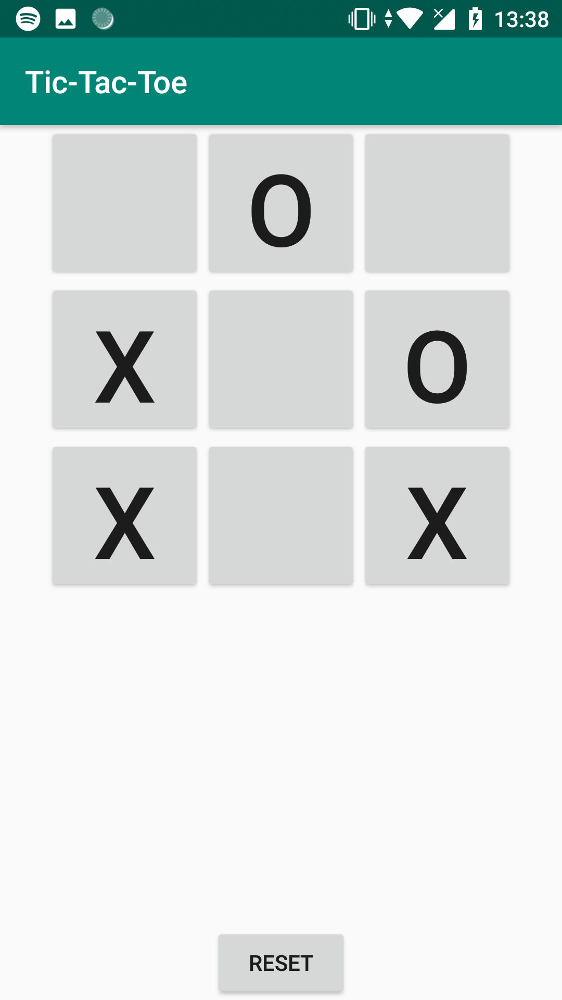
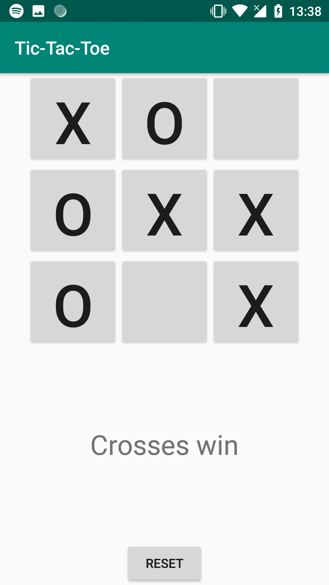
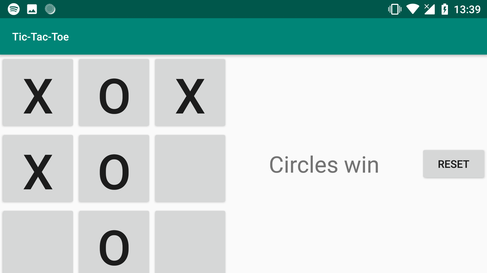

# Tic-Tac-Toe

## Author info
**Name:** Stefan Klut  
**Studentnumber:** 11331720  
**email:** stefanklut12@gmail.com

## Description
An app that lets you play Tic-Tac-Toe with a friend. The interface is a grid of 3x3 buttons, where if you click a button a cross or a circle will be appear in the button. The game will automatically alternate between crosses and circle. If a tile is selected that was already filled, it will let the user know that this is not a possible move. There is also a reset button to restart the game as if the app had only just started. To win the game a player must get three in a row of their icon (crosses or circles) in a row, column or a diagonal. If some win condition (including a draw) has been met, the game will let you know. After this the game will accept no further input, except the reset button.

## Screenshots

### Opening Screen:

### Some tile filled in:

### Crosses is the winner:

### Landscape mode:

      
